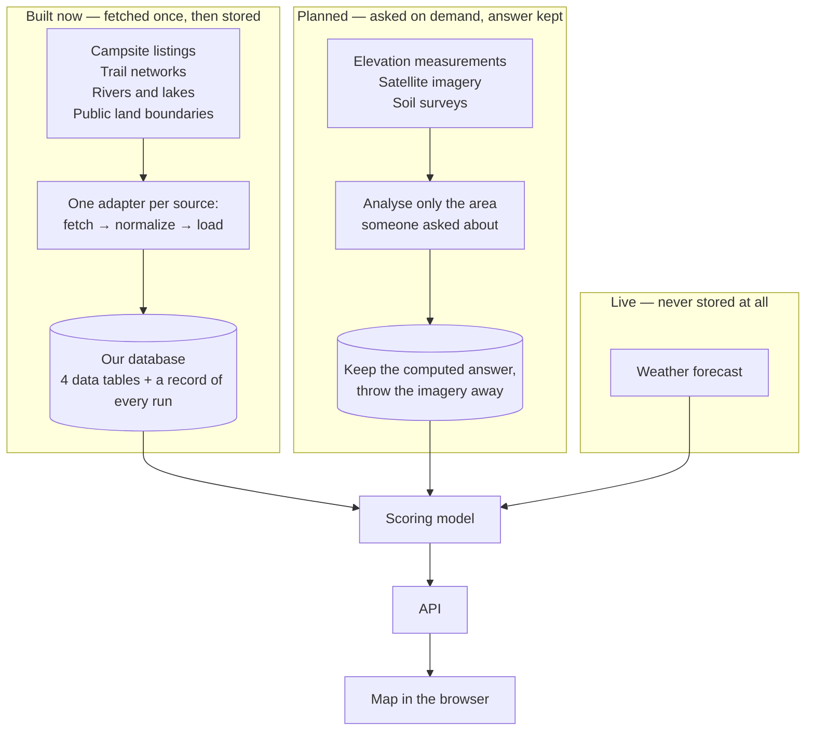

# How CampSite's data pipeline works

This document explains how CampSite collects and stores the geographic data behind its
campsite scores, and — more importantly — why it is built the way it is. It is written to
be readable without a background in mapping software. Where a technical term is
unavoidable, it is explained the first time it appears.

Anything described as **planned** has not been built yet. Everything else is working code
you can run today.

---

## What the pipeline is for

CampSite finds good backcountry campsites and scores them from 0 to 100. A good site is
flat, close to water, legal to camp on, and reachable by trail. To judge any of that, the
app needs real geographic facts: where the streams are, where the trails go, who owns the
land, how steep the ground is.

Those facts live in a dozen different government and community databases, each with its
own format, its own way of describing locations, and its own quirks. The pipeline is the
part of CampSite that goes and gets them, translates them into one consistent shape, and
files them somewhere the app can ask questions quickly.

The previous version of this project fetched everything fresh every time someone loaded a
map, using a separate hand-written script per data source. That was slow, fragile, and
impossible to reproduce. This rebuild exists to replace those scripts with one framework
that every data source plugs into.

---

## The shape of the system

Data moves through six stages:

**source clients → normalize → analysis → cache → API → UI**

A *source client* talks to one outside database. *Normalize* rewrites what came back into
CampSite's own vocabulary. *Analysis* computes things we care about, like steepness.
*Cache* stores results so we don't recompute them. The *API* answers the website's
questions, and the *UI* draws the map.

Not every kind of data takes the same route through those stages, and that distinction is
the most important design decision in the project:



---

## The core decision: store answers, not raw material

**Decision.** Small, slow-changing reference data — campsites, trails, water, land
ownership — gets fetched once and saved in our own database. Large data like satellite
imagery and elevation measurements does **not**. Instead we will ask the provider about
one specific area, compute the number we actually need, save that number, and discard the
source imagery.

**Why.** Consider what it would mean to store satellite imagery ourselves. A single
Sentinel-2 satellite image covers about 110 km by 110 km and runs to roughly a gigabyte.
Covering the Northeast alone would take hundreds of them, and the satellite revisits every
few days, so the collection would need constant updating to stay current. Multiply that by
the West Coast and Alaska and the storage bill becomes the largest cost in the project.

And we would be paying it for nothing. CampSite does not display satellite photos. It uses
them to answer narrow questions: is this spot forest or bare rock, how much vegetation is
there. Those answers are a handful of numbers per location. Storing gigabytes of pixels to
derive a few numbers, then never showing the pixels to anyone, is the wrong trade.

The same logic applies to elevation. We don't want the elevation of every point in Maine;
we want the *slope* at candidate campsites, because slope is what decides whether you can
sleep there. Slope is a small number computed from elevation. Keep the number.

**Alternative considered and rejected.** The obvious alternative was a conventional data
warehouse: download every source in bulk, store it all locally, run analysis over our own
copy. This is a normal pattern and it has real advantages — no dependency on a provider
staying available, and fast repeated analysis over the same area.

We rejected it for three reasons. The storage cost is disproportionate to a one-semester
student project. Bulk copies go stale the moment they finish downloading, so we'd inherit
an ongoing refresh problem. And the imagery is free to read directly from public cloud
storage, so keeping our own copy buys us little. The cost lands squarely on us and the
benefit is mostly theoretical for our use case.

**Consequence.** The pipeline is deliberately not a data warehouse. It is a small, careful
store of reference geography plus a cache of computed answers, each labelled with where it
came from.

---

## What we built: the vector layer

Four tables hold the reference geography that gets fetched and kept:

| Table | What it holds | Shape stored |
|---|---|---|
| `Campsite` | Individual campsites | A single point |
| `Trail` | Trail segments | One or more lines |
| `WaterFeature` | Streams, rivers, lakes, wetlands | Lines *or* shapes |
| `PublicLand` | Land ownership and camping legality | One or more shapes |

A few design choices are worth explaining.

**Everything is stored as latitude and longitude.** Different sources describe locations
using different coordinate systems — the US Geological Survey's water data and the federal
land database each use their own. Storing a mix would make comparing them unreliable. So
every source's coordinates are converted to plain latitude/longitude on the way in, and
that conversion happens in one shared place rather than in each source's code.

**Every table has a spatial index.** An index is a lookup structure that lets the database
answer "what is near here" without examining every row. Without one, finding campsites in
a map view would mean scanning the entire table. All four tables have one on their location
column.

**Each row carries the source's own ID, and the pair is unique.** Every record stores which
database it came from plus that database's own identifier for it — for example
OpenStreetMap's ID for a particular trail. That combination is required to be unique. This
is what makes it safe to re-run the pipeline: the second run recognises rows it has already
seen and updates them instead of creating duplicates. Re-running is then a routine
operation rather than something to be careful about.

**Water is stored loosely on purpose.** The `WaterFeature` table accepts either lines or
shapes, because the water database describes streams as lines and lakes as shapes, and the
scoring model cares about distance to water regardless of its shape.

**Every row keeps a copy of the original.** Alongside the tidy columns, each row stores the
untouched response from the source. This costs a little space and buys a lot: when we
discover later that we need a field nobody thought to extract, we can fill it in from data
we already have, instead of re-downloading everything from the network.

---

## Knowing where the data came from

Every time the pipeline runs, it writes a record of that run: which source, which region,
when it started and finished, how many records it wrote, whether it succeeded, and the
exact settings used. Every row of data then points back at the run that most recently
wrote it.

This matters more than it sounds, for a specific practical reason. Four people work on this
project, on four laptops, each with their own copy of the database. Without a record of
what ran, "it works on my machine" becomes unanswerable — two people can have genuinely
different data and no way to tell. With it, the question becomes a lookup: which source,
which area, how many rows, when.

The run record is also honest about failure. A run is marked failed the moment it starts
and only upgraded to successful once it finishes. If the process crashes or is killed
halfway, the record says failed, rather than claiming a success that never happened. A run
that partly worked — say most records loaded but a few had broken shapes — is recorded as
*partial*, with the reasons listed.

---

## Adding a new data source

Every source follows the same three steps:

1. **fetch** — go and get the raw data for a given area
2. **normalize** — rewrite it into our vocabulary and coordinate system
3. **load** — save it to the database, safely re-runnable

Only the first two are ever written by hand, because only they differ between sources.
Everything else is handled once, in shared code: converting coordinates, checking that
shapes are valid, saving without duplicating, writing the run record, and labelling each
row with its run.

In practice, adding a source means writing one file containing four declarations (its
name, which table it fills, and which coordinate system it arrives in) and two methods.
Nothing else in the project needs to change — not the shared code, not the command-line
tool, not the registry that keeps track of sources. This is verified rather than assumed:
the test suite builds several complete throwaway sources using only the public interface,
and they run end to end without touching framework code.

Sources announce themselves to a registry, so the command-line tool picks up a new source
automatically:

```
python manage.py ingest <source> <region>
python manage.py ingest --list-sources
python manage.py ingest --list-regions
```

**No real sources exist yet.** The four planned ones — Recreation.gov for campsites,
OpenStreetMap for trails, the USGS water database, and the federal public-lands database —
are the next story (TM05-13). `--list-sources` currently reports an empty list, which is
itself evidence that the framework does not depend on any particular source existing.

---

## Choosing where to look

The pipeline never has locations written into its code. Instead, the areas it works on live
in a configuration file, `regions.yml`, listing four areas to start with:

| Region | Covers |
|---|---|
| `adirondacks` | Adirondack Park, New York |
| `white-mountains-nh` | White Mountains, New Hampshire |
| `green-mountains-vt` | Green Mountains and the Long Trail, Vermont |
| `maine` | The whole state, including Baxter and the North Maine Woods |

Each entry gives the area a name, a rectangle of coordinates, which states it covers, and
notes for whoever writes the next source. Adding a region is editing this file — no code
changes, which is exactly what the four-region config already demonstrates.

The Northeast comes first because it has dense trail data and a lot of legally campable
public land. **Planned:** the West Coast (Colorado, Oregon, Washington, California) and
Alaska in later sprints, as additional entries in the same file. Alaska is worth flagging
in advance — its areas are enormous and community trail mapping there is far sparser, so
we should expect thinner results rather than treat them as a bug.

---

## What comes in later sprints

These use the on-demand pattern described above. They do **not** go through the ingestion
pipeline, and they will not get tables of their own in the reference database. All are
planned, none are built.

- **Elevation (USGS 3DEP)** — for slope and which way a site faces. Slope decides whether
  you can actually sleep somewhere, and aspect affects morning sun and snow melt. We want
  the computed slope, not the elevation data it came from.
- **Satellite imagery (Sentinel-2)** — for ground cover and vegetation density, to tell
  forest from bare rock from wetland. Read one small window at a time, never whole images.
  This is also where the project's machine-learning component belongs: classifying ground
  cover from imagery. The campsite score itself stays a transparent weighted calculation,
  so a user can always see why a site scored what it did, factor by factor.
- **Soil surveys (SSURGO)** — for drainage. Well-drained ground is the difference between
  a dry night and a puddle.
- **Detailed laser elevation (LiDAR)** — used where available, since it is far more precise
  than standard elevation data, but coverage is patchy so it can't be relied on everywhere.

In each case the pattern is the same: ask about one specific area, compute what we need,
store the answer with a note about where and when it came from, discard the source data.

---

## Weather is a deliberate exception

Weather does not go through any of this. It is fetched live from Open-Meteo when someone
asks, held briefly, and never saved to the database.

The reason is simple: a stored forecast is a wrong forecast. Every other kind of data here
describes something that changes over years or not at all — a lake does not move, a
wilderness boundary rarely shifts. A forecast is obsolete within hours. Saving it would
mean carefully maintaining a table whose entire contents are guaranteed to be stale.

So weather takes a thin separate path that bypasses the ingestion framework completely.
This is a decision, not an oversight. **Planned** — not yet built.

---

## Known limitations

Three things are worth knowing before building on this.

**Distances in the database are measured in degrees, not metres.** Locations are stored as
latitude and longitude numbers, and measuring the plain arithmetic distance between two
such numbers produces an answer in degrees of arc. That is not a distance in any useful
sense, and worse, it is inconsistent: in the Adirondacks one degree of longitude is about
79 km while one degree of latitude is about 111 km. A naive distance calculation would
therefore distort east-west versus north-south, and the distortion changes as you move
north. The fix is to explicitly ask the database to treat the coordinates as points on a
globe when measuring, which must be done in the scoring code. Storage is not affected —
this is purely about how queries are written, and it is documented in the code where
someone would hit it.

**Recreation.gov only covers federal land.** It is a federal system, so it lists Forest
Service and Park Service campsites but knows nothing about state land. That is a real gap
for our first region: Adirondack Park is New York state land managed by the state
environmental agency, so almost none of its campsites appear there. Adirondack campsite
coverage will have to come from OpenStreetMap instead, which is community-maintained and
therefore less consistent in its detail. Worth knowing before anyone concludes the
Adirondack campsite data looks thin because of a bug.

**The database image runs emulated on Apple Silicon Macs.** The PostGIS database image is
built for Intel processors, so on an M-series Mac it runs through a translation layer. It
works correctly — everything in this project was developed that way — but it is measurably
slower than native. Fine for development; worth remembering before anyone treats local
timings as meaningful performance numbers.

---

## Where the code lives

```
backend/pipeline/
  aoi.py                          a region: name, label, bounding box, states, notes
  regions.yml                     the four Northeast regions
  regions.py                      reads that file, reports unknown names clearly
  adapters/base.py                the shared three-step contract
  adapters/registry.py            how sources announce themselves
  management/commands/ingest.py   the command-line tool

backend/geodata/
  models.py                       the four data tables and the run record
  migrations/                     the database schema history

tests/
  test_pipeline_regions.py        configuration and bounding-box validation
  test_pipeline_adapters.py       the framework, using throwaway sources
  test_geodata_models.py          the tables, including the no-duplicates rule
```
