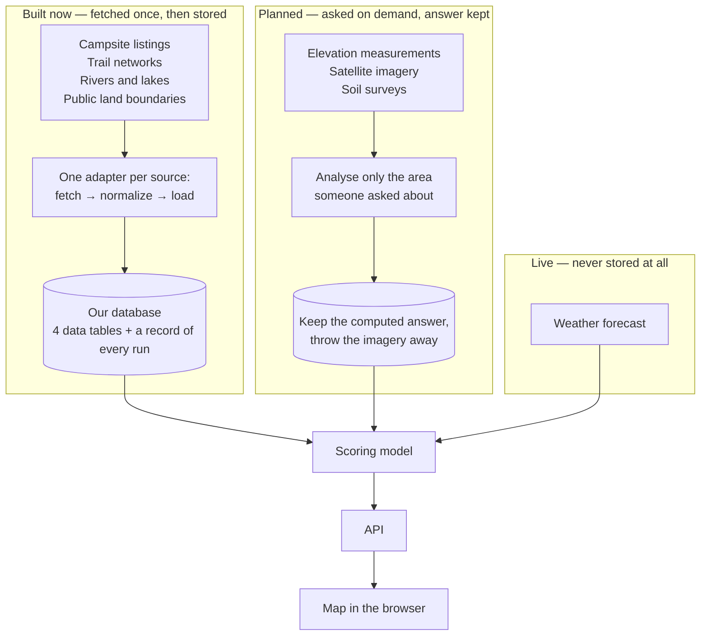

# How CampSite's data pipeline works

This document explains how CampSite collects and stores the geographic data behind its
campsite scores, and — more importantly — why it is built the way it is. It is written to
be readable without a background in mapping software. Where a technical term is
unavoidable, it is explained the first time it appears.

Anything described as **planned** has not been built yet. Everything else is working code
you can run today.

---

## What the pipeline is for

CampSite finds good backcountry campsites and scores them from 0 to 100. A good site is
flat, close to water, legal to camp on, and reachable by trail. To judge any of that, the
app needs real geographic facts: where the streams are, where the trails go, who owns the
land, how steep the ground is.

Those facts live in a dozen different government and community databases, each with its
own format, its own way of describing locations, and its own quirks. The pipeline is the
part of CampSite that goes and gets them, translates them into one consistent shape, and
files them somewhere the app can ask questions quickly.

The previous version of this project fetched everything fresh every time someone loaded a
map, using a separate hand-written script per data source. That was slow, fragile, and
impossible to reproduce. This rebuild exists to replace those scripts with one framework
that every data source plugs into.

---

## The shape of the system

Data moves through six stages:

**source clients → normalize → analysis → cache → API → UI**

A *source client* talks to one outside database. *Normalize* rewrites what came back into
CampSite's own vocabulary. *Analysis* computes things we care about, like steepness.
*Cache* stores results so we don't recompute them. The *API* answers the website's
questions, and the *UI* draws the map.

Not every kind of data takes the same route through those stages, and that distinction is
the most important design decision in the project:


```mermaid
flowchart TD
    subgraph built["Built now — fetched once, then stored"]
        V1["Campsite listings<br/>Trail networks<br/>Rivers and lakes<br/>Public land boundaries"]
        V2["One adapter per source:<br/>fetch → normalize → load"]
        V3[("Our database<br/>4 data tables + a record of every run")]
        V1 --> V2 --> V3
    end

    subgraph planned["Planned — asked on demand, answer kept"]
        R1["Elevation measurements<br/>Satellite imagery<br/>Soil surveys"]
        R2["Analyse only the area<br/>someone asked about"]
        R3[("Keep the computed answer,<br/>throw the imagery away")]
        R1 --> R2 --> R3
    end

    subgraph live["Live — never stored at all"]
        W1["Weather forecast"]
    end

    V3 --> S["Scoring model"]
    R3 --> S
    W1 --> S
    S --> API["API"]
    API --> UI["Map in the browser"]
```

---

## The core decision: store answers, not raw material

**Decision.** Small, slow-changing reference data — campsites, trails, water, land
ownership — gets fetched once and saved in our own database. Large data like satellite
imagery and elevation measurements does **not**. Instead we will ask the provider about
one specific area, compute the number we actually need, save that number, and discard the
source imagery.

**Why.** Consider what it would mean to store satellite imagery ourselves. A single
Sentinel-2 satellite image covers about 110 km by 110 km and runs to roughly a gigabyte.
Covering the Northeast alone would take hundreds of them, and the satellite revisits every
few days, so the collection would need constant updating to stay current. Multiply that by
the West Coast and Alaska and the storage bill becomes the largest cost in the project.

And we would be paying it for nothing. CampSite does not display satellite photos. It uses
them to answer narrow questions: is this spot forest or bare rock, how much vegetation is
there. Those answers are a handful of numbers per location. Storing gigabytes of pixels to
derive a few numbers, then never showing the pixels to anyone, is the wrong trade.

The same logic applies to elevation. We don't want the elevation of every point in Maine;
we want the *slope* at candidate campsites, because slope is what decides whether you can
sleep there. Slope is a small number computed from elevation. Keep the number.

**Alternative considered and rejected.** The obvious alternative was a conventional data
warehouse: download every source in bulk, store it all locally, run analysis over our own
copy. This is a normal pattern and it has real advantages — no dependency on a provider
staying available, and fast repeated analysis over the same area.

We rejected it for three reasons. The storage cost is disproportionate to a one-semester
student project. Bulk copies go stale the moment they finish downloading, so we'd inherit
an ongoing refresh problem. And the imagery is free to read directly from public cloud
storage, so keeping our own copy buys us little. The cost lands squarely on us and the
benefit is mostly theoretical for our use case.

**Consequence.** The pipeline is deliberately not a data warehouse. It is a small, careful
store of reference geography plus a cache of computed answers, each labelled with where it
came from.

---

## What we built: the vector layer

Four tables hold the reference geography that gets fetched and kept:

| Table | What it holds | Shape stored |
|---|---|---|
| `Campsite` | Individual campsites | A single point |
| `Trail` | Trail segments | One or more lines |
| `WaterFeature` | Streams, rivers, lakes, wetlands | Lines *or* shapes |
| `PublicLand` | Land ownership and camping legality | One or more shapes |

A few design choices are worth explaining.

**Everything is stored as latitude and longitude.** Different sources describe locations
using different coordinate systems — the US Geological Survey's water data and the federal
land database each use their own. Storing a mix would make comparing them unreliable. So
every source's coordinates are converted to plain latitude/longitude on the way in, and
that conversion happens in one shared place rather than in each source's code.

**Every table has a spatial index.** An index is a lookup structure that lets the database
answer "what is near here" without examining every row. Without one, finding campsites in
a map view would mean scanning the entire table. All four tables have one on their location
column.

**Each row carries the source's own ID, and the pair is unique.** Every record stores which
database it came from plus that database's own identifier for it — for example
OpenStreetMap's ID for a particular trail. That combination is required to be unique. This
is what makes it safe to re-run the pipeline: the second run recognises rows it has already
seen and updates them instead of creating duplicates. Re-running is then a routine
operation rather than something to be careful about.

**Water is stored loosely on purpose.** The `WaterFeature` table accepts either lines or
shapes, because the water database describes streams as lines and lakes as shapes, and the
scoring model cares about distance to water regardless of its shape.

**Every row keeps a copy of the original.** Alongside the tidy columns, each row stores the
untouched response from the source. This costs a little space and buys a lot: when we
discover later that we need a field nobody thought to extract, we can fill it in from data
we already have, instead of re-downloading everything from the network.

---

## Measuring distance in metres (TM05-42)

Scoring is mostly distance: how far to water, how far to a trail. The tables store
latitude/longitude (EPSG:4326), and a distance computed on those numbers comes back in
*degrees*, which is not a usable unit and is not even consistent — at Adirondack latitude a
degree of longitude is ~79 km and a degree of latitude ~111 km. Before this change there
were two ways to ask "how far is the nearest water", and neither was acceptable: one was
fast but answered in degrees, the other answered in metres but could not use the index.

**What we chose: a projected metre column.** Campsites, trails and water each carry a second
geometry column, `geom_m`, holding the same shape projected to **EPSG:5070** (the US
Albers projection, units of metres), with its own spatial index. The database generates it
from `geom` (`GENERATED ALWAYS AS (ST_Transform(geom, 5070)) STORED`), so nothing that
writes data — the pipeline, fixtures, the admin — can forget to update it. All distance
queries go through `backend/geodata/distance.py` (`nearest()`, `nearest_distance_m()`,
`within()`), which measure on `geom_m` and order nearest-first with the index-aware `<->`
operator.

**The alternative we rejected: a geography index.** PostGIS can index the "geography"
(round-earth) version of each shape and answer in metres directly. It works and is slightly
more accurate, but it measured 28× slower than the projected column on the same query,
because every candidate comparison is done on the spheroid, and lakes with thousands of
vertices make that expensive. The projected column's accuracy loss is measured and small
(below), so the speed wins.

### Measured, not estimated

Same query — nearest water for each of 150 candidate campsites (the first 150 by id in the
Adirondack box) against all 76,551 water features. Median of 5 warm runs of `EXPLAIN
ANALYZE`, reproducible with `python manage.py bench_distance`. Measured 2026-10-02 on the
local Docker PostGIS (emulated on Apple Silicon, see Known limitations, so absolute numbers
are pessimistic; the ratios are what matter).

| Query | Units | Index used on water? | Time |
|---|---|---|---|
| Before: KNN on the 4326 index | degrees (wrong) | yes | 15.3 ms |
| Before: geography cast, ~1 km bbox prefilter | metres | yes (prefilter only) | 441 ms |
| Before: geography cast, ~5 km bbox prefilter | metres | yes (prefilter only) | 2,515 ms |
| Before: geography cast, no prefilter | metres | **no — sequential scan** | > 5 min (cancelled) |
| Geography GiST index + KNN (rejected) | metres | yes | 406 ms |
| **After: KNN on `geom_m` (5070)** | **metres** | **yes** | **14.6 ms** |

The story's original figures (51 ms and 608 ms) were single cold runs; the first cold run
of the degree KNN here was 61 ms, consistent with that. Through the ORM, as scoring will call
it, 150 `nearest_distance_m()` calls take 217 ms in total (~1.4 ms each including the round
trip), and water plus trail for all 150 sites takes 365 ms.

The "after" plan, from `EXPLAIN ANALYZE` on a single nearest-water lookup:

```
Limit (actual time=0.277..0.278 rows=1 loops=1)
  ->  Index Scan using water_geom_m_gist on geodata_waterfeature (actual rows=1 loops=1)
        Order By: (geom_m <-> '...'::geometry)
Execution Time: 0.449 ms
```

A radius query (`within()`, ST_DWithin 500 m) is an `Index Scan using water_geom_m_gist`
with `Index Cond: (geom_m && st_expand(...))`, 1.1–1.8 ms.

**Accuracy.** For every ingested campsite whose nearest water is more than 1 m away (1,276
sites), the 5070 distance was compared with the true geodesic distance PostGIS computes on
the spheroid: mean error **0.22%**, worst **0.55%**, largest absolute error **3.5 m**. The
water curve peaks at 60 m, so this is well inside what scoring can notice.

**Two traps, both handled in `distance.py`:**

- *Ordering by `ST_Distance` looks like nearest-first and is not index-assisted* — it computes
  the distance to every row. Only `ORDER BY geom_m <-> point` walks the index.
- *Transform the query point in the database, not in Python.* 4326 → 5070 includes a datum
  step, and the PROJ inside PostGIS and the one linked by local GDAL chose different
  transformations, measured 0.26 m apart. `geom_m` is computed by PostGIS, so the query
  point is too (`ST_Transform` of a constant is folded once, so the index still applies).

**What did not change.** `geom` is untouched and every existing API query still uses it, so
the map endpoints behave exactly as before (their tests pass unchanged). Public land is not
given a metric column: scoring asks *which* parcel a point is in, a containment question
that units do not affect. The pipeline's upsert now skips generated columns, which the
database refuses to have written.

---

## Knowing where the data came from

Every time the pipeline runs, it writes a record of that run: which source, which region,
when it started and finished, how many records it wrote, whether it succeeded, and the
exact settings used. Every row of data then points back at the run that most recently
wrote it.

This matters more than it sounds, for a specific practical reason. Four people work on this
project, on four laptops, each with their own copy of the database. Without a record of
what ran, "it works on my machine" becomes unanswerable — two people can have genuinely
different data and no way to tell. With it, the question becomes a lookup: which source,
which area, how many rows, when.

The run record is also honest about failure. A run is marked failed the moment it starts
and only upgraded to successful once it finishes. If the process crashes or is killed
halfway, the record says failed, rather than claiming a success that never happened. A run
that partly worked — say most records loaded but a few had broken shapes — is recorded as
*partial*, with the reasons listed.

---

## Adding a new data source

Every source follows the same three steps:

1. **fetch** — go and get the raw data for a given area
2. **normalize** — rewrite it into our vocabulary and coordinate system
3. **load** — save it to the database, safely re-runnable

Only the first two are ever written by hand, because only they differ between sources.
Everything else is handled once, in shared code: converting coordinates, checking that
shapes are valid, saving without duplicating, writing the run record, and labelling each
row with its run.

In practice, adding a source means writing one file containing four declarations (its
name, which table it fills, and which coordinate system it arrives in) and two methods.
Nothing else in the project needs to change — not the shared code, not the command-line
tool, not the registry that keeps track of sources. This is verified rather than assumed:
the test suite builds several complete throwaway sources using only the public interface,
and they run end to end without touching framework code.

Sources announce themselves to a registry, so the command-line tool picks up a new source
automatically:

```
python manage.py ingest <source> <region>
python manage.py ingest --list-sources
python manage.py ingest --list-regions
```

**No real sources exist yet.** The four planned ones — Recreation.gov for campsites,
OpenStreetMap for trails, the USGS water database, and the federal public-lands database —
are the next story (TM05-13). `--list-sources` currently reports an empty list, which is
itself evidence that the framework does not depend on any particular source existing.

---

## Choosing where to look

The pipeline never has locations written into its code. Instead, the areas it works on live
in a configuration file, `regions.yml`, listing four areas to start with:

| Region | Covers |
|---|---|
| `adirondacks` | Adirondack Park, New York |
| `white-mountains-nh` | White Mountains, New Hampshire |
| `green-mountains-vt` | Green Mountains and the Long Trail, Vermont |
| `maine` | The whole state, including Baxter and the North Maine Woods |

Each entry gives the area a name, a rectangle of coordinates, which states it covers, and
notes for whoever writes the next source. Adding a region is editing this file — no code
changes, which is exactly what the four-region config already demonstrates.

The Northeast comes first because it has dense trail data and a lot of legally campable
public land. **Planned:** the West Coast (Colorado, Oregon, Washington, California) and
Alaska in later sprints, as additional entries in the same file. Alaska is worth flagging
in advance — its areas are enormous and community trail mapping there is far sparser, so
we should expect thinner results rather than treat them as a bug.

---

## What comes in later sprints

These use the on-demand pattern described above. They do **not** go through the ingestion
pipeline, and they will not get tables of their own in the reference database. All are
planned, none are built.

- **Elevation (USGS 3DEP)** — for slope and which way a site faces. Slope decides whether
  you can actually sleep somewhere, and aspect affects morning sun and snow melt. We want
  the computed slope, not the elevation data it came from.
- **Satellite imagery (Sentinel-2)** — for ground cover and vegetation density, to tell
  forest from bare rock from wetland. Read one small window at a time, never whole images.
  This is also where the project's machine-learning component belongs: classifying ground
  cover from imagery. The campsite score itself stays a transparent weighted calculation,
  so a user can always see why a site scored what it did, factor by factor.
- **Soil surveys (SSURGO)** — for drainage. Well-drained ground is the difference between
  a dry night and a puddle.
- **Detailed laser elevation (LiDAR)** — used where available, since it is far more precise
  than standard elevation data, but coverage is patchy so it can't be relied on everywhere.

In each case the pattern is the same: ask about one specific area, compute what we need,
store the answer with a note about where and when it came from, discard the source data.
That pattern is now built (TM05-44); see the next section for how to add one.

## On-demand analysis and the answer cache (TM05-44)

The ingestion pipeline handles data worth keeping whole. Everything else — elevation,
imagery, weather — uses the second pattern this document describes: ask about one specific
place, compute the answer, cache the *answer* with a note of how it was made, and throw
the raw material away. `backend/analysis/` implements it.

### The contract

An analysis is a subclass of `analysis.base.Analysis`, the counterpart of `SourceAdapter`:

| | SourceAdapter (ingestion) | Analysis (on demand) |
|---|---|---|
| Triggered by | `manage.py ingest`, for a configured region | a request, for one geometry |
| Keeps | the data, in a reference table | the computed answer, in `AnalysisResult` |
| You write | `fetch()`, `normalize()` | `compute(geom, window, params) -> Computed(value, provenance)` |
| You declare | name, model, source SRID | `name`, `version`, `ttl`, `grid_degrees` |
| Framework does | reprojection, validation, upsert, run record | cache key, hit/miss, expiry, provenance, purge |

Callers use one method, `run(geom, params)`, which returns an `Outcome` (`value`,
`provenance`, `cached`, `key`, `computed_at`, `expires_at`). If a fresh answer exists it is
returned without calling `compute()`. Otherwise `compute()` runs, the answer is stored,
and expired answers of that analysis are purged. A `compute()` that raises
`AnalysisError` stores nothing, so a failure is never cached.

### The cache key

```
sha256( canonical JSON of {analysis, version, geometry, window, params} )
```

- **analysis + version** — bumping `version` invalidates every cached answer of that
  analysis without a migration.
- **geometry** — EPSG:4326 WKT at 6 decimal places (~0.1 m), so float noise in a request
  cannot split one answer into two. Analyses whose source has a coarse grid set
  `grid_degrees`, and *points* are snapped to the centre of that grid cell first so nearby
  requests share an answer. Lines and polygons are never snapped: snapping a route would
  change what is being analysed.
- **window** — the time span the answer covers, from the analysis's `window_for(now)`.
  `None` for timeless answers such as slope.
- **params** — sorted, so `{"a":1,"b":2}` and `{"b":2,"a":1}` are the same entry.

The parts are also stored as columns (`analysis`, `version`, `geom`, `window_start`,
`window_end`, `params`) so the cache can be inspected and queried, not just looked up.

### Time-to-live, per source

| Analysis | TTL | Grid | Why |
|---|---|---|---|
| `weather` (Open-Meteo) | **1 hour** | 0.05° (~5 km) | Open-Meteo refreshes hourly; its models answer per grid cell anyway (two points 2 km apart came back as the same cell). |
| slope / aspect (3DEP, planned) | 1 year | none | Terrain does not change; a year bounds how long a bad answer could survive. |
| land cover / NDVI (Sentinel-2, planned) | 30 days | none | Revisit is ~5 days, but vegetation changes on a seasonal scale. |
| soil drainage (SSURGO, planned) | 1 year | none | Survey data is updated annually at most. |

Expiry is a hard stop: an entry past `expires_at` is never served, and is deleted the next
time that analysis stores an answer.

### Provenance

Every stored answer records what was used, when, and with what parameters: the analysis
name and version, the request parameters, `computed_at`, and whatever the analysis adds —
for weather, the endpoint, the exact request, the grid cell the API answered for, and its
`generationtime_ms`. That makes "where did this number come from?" a lookup, the same way
the ingest run record does for reference data.

### Weather, the first analysis

`analysis/analyses/weather.py`, verified live before use on 2026-10-02:

```
GET https://api.open-meteo.com/v1/forecast?latitude=…&longitude=…
    &current=temperature_2m,precipitation,wind_speed_10m,wind_gusts_10m,weather_code
    &daily=temperature_2m_min,temperature_2m_max,precipitation_sum,
           precipitation_probability_max,wind_speed_10m_max,wind_gusts_10m_max
    &forecast_days=3&timezone=auto
→ 200, ~0.7–0.8 s, no key. {latitude, longitude, elevation, timezone, current{…}, daily{time[], …[]}}
```

The full recorded response is `tests/fixtures/open_meteo_forecast.json`. The stored value
keeps only the grid cell, the current conditions and one row per day; the payload is
discarded. A response that does not have the verified shape raises `AnalysisError` instead
of being cached half-understood. It is fetched with one quick retry and a 5 s timeout,
because it sits on the scoring path, where failing fast and reporting the factor as
`not_available` beats making someone wait.

It feeds the scoring engine as a fourth factor (`WeatherFactor`, docs/scoring.md).
Measured: a cache miss took 734 ms and a repeat request for the same cell 4.9 ms. Scoring
100 campsites from a cold weather cache took 6.7 s — those 100 sites fall in just 5 grid
cells, so 5 API calls — and 0.9–1.2 s warm.

### Adding the next analysis (elevation, imagery)

1. Subclass `Analysis` in `backend/analysis/analyses/`. Set `name`, `version`, `ttl`, and
   `grid_degrees` (usually `None` for raster work keyed by exact geometry).
2. Implement `compute()`: read the smallest window of source data that answers the
   question (a windowed COG read, never a whole scene), reduce it to the answer, return
   `Computed(value, provenance)`. Do not return pixels.
3. Override `window_for()` only if the answer depends on time.
4. Add its TTL to the table above, with the reason.
5. If it feeds scoring, replace the matching placeholder factor's `evaluate()` to call
   `run()`, and treat `AnalysisError` as `not_available`.

---

## Weather is a deliberate exception

Weather does not go through the ingestion pipeline, and it is never kept as data. A
stored forecast is a wrong forecast: every other kind of data here describes something
that changes over years or not at all, while a forecast is obsolete within hours.
Maintaining a table of forecasts would mean carefully keeping something guaranteed to be
stale.

It is fetched live from Open-Meteo when someone asks and **held for at most an hour** in
the analysis cache (see "On-demand analysis and the answer cache"): one row per grid cell,
deleted once it expires. That is a cache, not a history. Nothing reads an expired forecast,
and nothing accumulates. TM05-44 made weather the first analysis precisely because it
exercises that cache path end to end without any raster work depending on it.

---

## Known limitations

Three things are worth knowing before building on this.

**The metre column only covers the contiguous US.** Distances are measured in EPSG:5070
(see "Measuring distance in metres"), which is designed for the lower 48 states. The
Northeast and the planned West Coast regions are inside it; **Alaska is not**, and
distances there would be distorted. Adding an Alaska region means switching that region to
EPSG:3338 (Alaska Albers) first — decide this before ingesting Alaska data, not after.

**Recreation.gov only covers federal land.** It is a federal system, so it lists Forest
Service and Park Service campsites but knows nothing about state land. That is a real gap
for our first region: Adirondack Park is New York state land managed by the state
environmental agency, so almost none of its campsites appear there. Adirondack campsite
coverage will have to come from OpenStreetMap instead, which is community-maintained and
therefore less consistent in its detail. Worth knowing before anyone concludes the
Adirondack campsite data looks thin because of a bug.

**The database image runs emulated on Apple Silicon Macs.** The PostGIS database image is
built for Intel processors, so on an M-series Mac it runs through a translation layer. It
works correctly — everything in this project was developed that way — but it is measurably
slower than native. Fine for development; worth remembering before anyone treats local
timings as meaningful performance numbers.

---

## Where the code lives

```
backend/pipeline/
  aoi.py                          a region: name, label, bounding box, states, notes
  regions.yml                     the four Northeast regions
  regions.py                      reads that file, reports unknown names clearly
  adapters/base.py                the shared three-step contract
  adapters/registry.py            how sources announce themselves
  management/commands/ingest.py   the command-line tool

backend/analysis/
  base.py                         the Analysis contract: cache key, hit/miss, expiry
  models.py                       AnalysisResult, the answer cache with provenance
  analyses/weather.py             Open-Meteo forecast, the first analysis

backend/geodata/
  models.py                       the four data tables and the run record
  distance.py                     metre-correct, indexed distance queries
  management/commands/bench_distance.py   re-measures the numbers above
  migrations/                     the database schema history

tests/
  test_pipeline_regions.py        configuration and bounding-box validation
  test_pipeline_adapters.py       the framework, using throwaway sources
  test_geodata_models.py          the tables, including the no-duplicates rule
  test_geodata_distance.py        distances in metres, checked against geodesic truth
```
